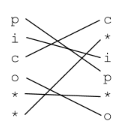
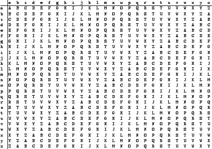
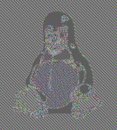
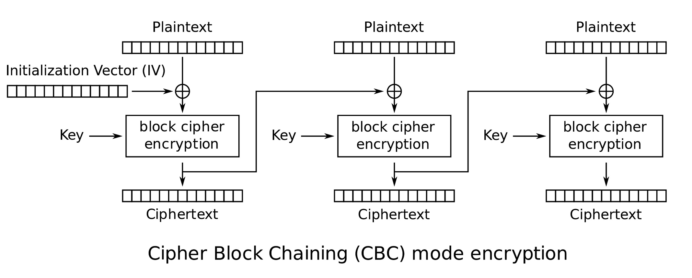

# Cryptography!
So you want to encode information?

### Example 1:
Zip compress:
```
zip --encrypt -r encrypted_zipfile.zip original file/
```
Will compress the information contained within this directory, requiring a **key**, or **password**, to access

## Ciphers(old, basic):
**TIP: in general just use [this website](https://www.dcode.fr/cipher-identifier) to do all this caesar ciphers, most relevant for easy-to-hard level challenges to prevent basic word searching**

### Substitution Cipher
each letter is replaced by another
Python Script for this(if you want to learn some python):
```
def caesar_encrypt(text):
    result = ""

    # Go through each character of the text in this for loop
    for i in range(len(text)):

        # Obtain the ASCII value using ord
        char_position = ord(text[i])

        # Substract 97 to have a character from 1 to 26
        char_position = char_position - 97

        # Add 3 to the position, as caesar does
        new_char_position = char_position + 3

        # Make sure that the position does not surpass 26 (we wrap around)
        new_char_position = new_char_position % 26

        # Convert back to ASCII values
        new_char_position = new_char_position + 97

        # Convert ASCII value to character and concatenate it to final result
        result = result + chr(new_char_position)

        print(result)
    return result

def caesar_decrypt(cipher_text):
    result = ""

    # Go through each character of the text in this for loop
    for i in range(len(cipher_text)):

        # Obtain the ASCII value using ord
        char_position = ord(cipher_text[i])

        # Substract 97 to have a character from 1 to 26
        char_position = char_position - 97

        # Substract 3 to the position, to get back original position
        new_char_position = char_position - 3

        # Make sure that the position does not surpass 26 (we wrap around)
        new_char_position = new_char_position % 26

        # Convert back to ASCII values
        new_char_position = new_char_position + 97

        # Convert ASCII value to character and concatenate it to final result
        result = result + chr(new_char_position)

        print(result)
    return result

text = "picoctf"
print(f"Plain Text: {text}")
cipher_text = caesar_encrypt(text)
print(f"Encrypted: {cipher_text}")
print(f"Decrypted: {caesar_decrypt(cipher_text)}")
```
You could probably understand this if you have experience with programming

use the website!

### Transposition Ciphers
Changes the position of each letter in set chunks
Padding could be added to fill the extra space if it doesn’t fit a chunk:



### Key Cipher (Vigenere Cipher)
- uses the table below to match the “coordinates” to the table

  
- Note that	the key will repeat

Not the most secure, like the other ones above
Demonstrated with [this](https://www.simonsingh.net/The_Black_Chamber/vigenere_cracking_tool.html) example:

## How We Do it Now:
**Symmetric Cryptography**:
	Same key for encrypt and decrypt
**Asymmetric Cryptography**:
	Different key for encrypt and decrypt
  	Encryption key is called the public key
    Decryption key is caled the private key

### Advanced Encryption Standard(AES)(Symmetric)
Two types of key, that’s why you have AES256 and AES128 for the length (in bits) of their keys

It has two operation modes
#### ECB:
Breaks down the text into chunks of 128/256, then encrypts these chunks independently

**Problem: retains structure**

##### Example 1 of problem:
  

  becomes
  

hmm i don’t think this encryption does a good job

##### Example 2 of problem:
if the first half of a file contains the name and the second half contains the date

by swapping only the end half of the file, you could effectively change the date of the encrypted file without the original encryptor knowing

oh yeah, and its always the same

#### CBC
Better over the previous one:
1. Different everytime due to a different random initilization vector
2. Progressively encrypts the previous encrypted text for even more encryption

Diagram:


Similar to transposition, some padding is needed

Instead of standard ASCII symbols, it pads it with simple bytes that might not be visible

### Rivest Shamir Adleman(RSA)(Asymmetric)
Anyone with the public key can send a message, but only the person with a different private key would be able to decrypt it and read its contents
#### Basic formula:
RSA public key (e,n)
RSA private key (d,n)
message=m
encyrpted message=c

To encrypt: m^e mod n =c
To decrypt: c^d mod n =m

note that ’n’ is part of both keys

