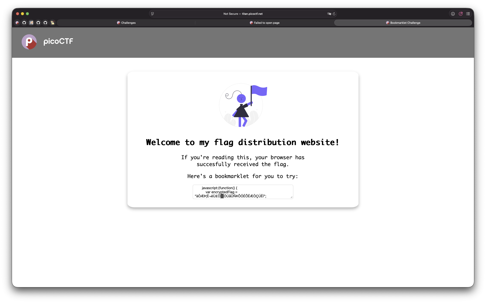
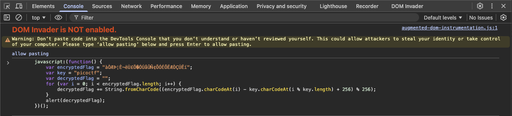

# [BookMarklet](https://play.picoctf.org/practice/challenge/406?category=1&difficulty=1&page=1)
Can be solved by only using the web console

By default, the site looks like this:


You will have to expand this text box by dragging that thing at the bottom right corner

After resizing, the website will copy that code into the keyboard 4 u
```
        javascript:(function() {
            var encryptedFlag = "àÒÆަȬë٣֖ÓÚåÛÑ¢ÕÓÉÕËÆÒÇÚËí";
            var key = "picoctf";
            var decryptedFlag = "";
            for (var i = 0; i < encryptedFlag.length; i++) {
                decryptedFlag += String.fromCharCode((encryptedFlag.charCodeAt(i) - key.charCodeAt(i % key.length) + 256) % 256);
            }
            alert(decryptedFlag);
        })();

```
You will realize that this is some very fancy javascript, but notice that you are provided with all the means to solve it:

Go to your web inspector, go to the console, and simply run the JS code from there.


Boom. The popup contains the flag
