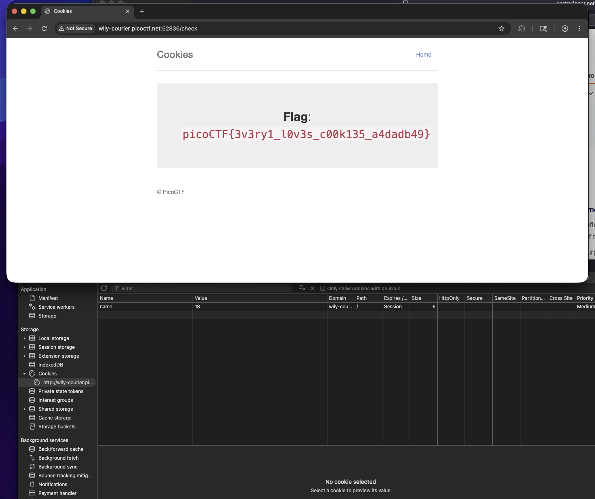

# [Cookies](https://play.picoctf.org/practice/challenge/173?category=1&difficulty=1&page=2)

idk what the markup is on about
1. Open up the web inspector and look at the cookies section

   You should see a cookie with name -1 and value -1
2. Enter `snickerdoodle` into the text field

  You should see that after this the value of the cookie is no longer -1, but 0

3. keep trying different numbers
4. At 18, its spits out the flag

Note:
You don’t even need to enter `snickerdoodle`

You can just change the value of the cookie right there to 18 and it will give it to you as well

