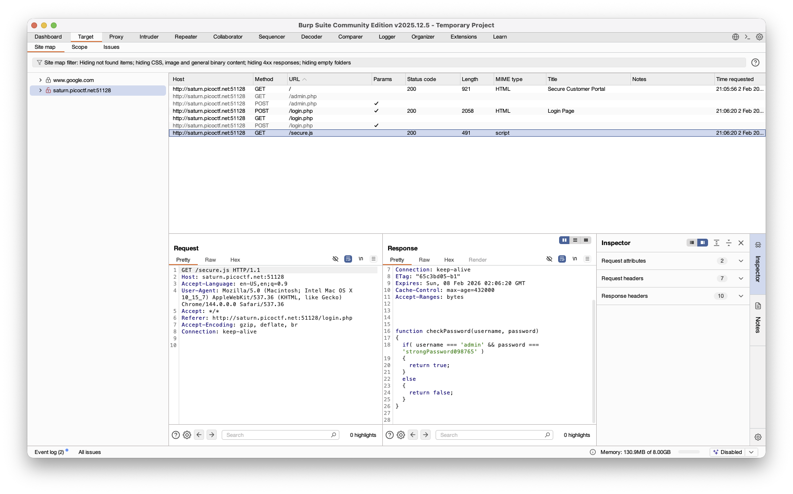

# [Local Authority](https://play.picoctf.org/practice/challenge/278?category=1&difficulty=1&page=1)
This challenge will involve using BurpSuite

To understand this challange, know that there are two types of stuff burpsuite knows from the “Target” tab:
1. GET (stuff sent from the server)
2. POST (Something your computer request to the server)

Here, we want to have the site send us a hidden `secure.js` file

We send it a dummy login and password to bait it to send it to use
After, it should have the information provided in the following file it sends us:

Then, login using the provided Username and password
