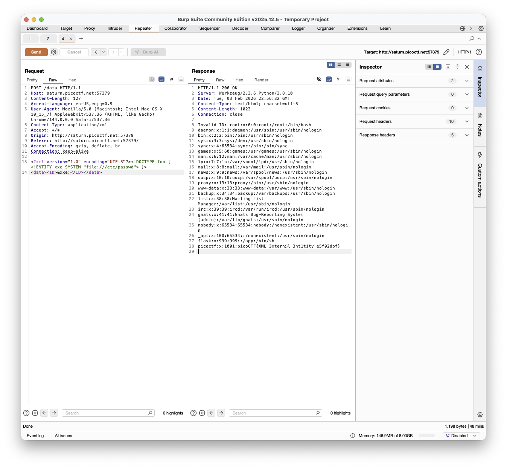

# [SOAP](https://play.picoctf.org/practice/challenge/376?category=1&difficulty=2&page=1)

This is where things get interesting
Notice that every time you press the details button, a new /data appears under the sources tab in the web inspector, which means that there is always a request being sent, and data being received.

You can also confirm this if you look in burpsuite

You are expected to realize that the resulting requests are made in XML, and since there is no protection against that, it is vulnerable to [XXE](https://portswigger.net/web-security/xxe) attacks

Following the instructions on the link provided will grant the flag included in the response from the server:

